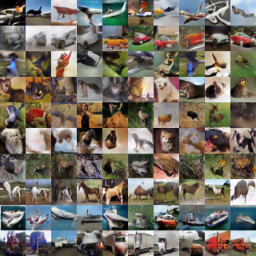

# ACGAN

[ACGAN](http://proceedings.mlr.press/v70/odena17a.html) implementation with [Chainer](https://github.com/chainer/chainer).

My implementation supports only for CIFAR-10.
The architecture is different from the listed architecture of the original paper.

## Result

The following generated image is at the 50000 iteration.



## Requirements


Python and main packages version are as follows:

* Chainer 4.4.0
* CuPy 4.4.1
* PIL 5.2.0

## Usage

Just run the main script.

```
python train_main.py
```

## References

* [Augustus Odena, Christopher Olah, Jonathon Shlens; Conditional Image Synthesis with Auxiliary Classifier GANs
. Proceedings of the 34th International Conference on Machine Learning, PMLR 70:2642-2651, 2017.
](http://proceedings.mlr.press/v70/odena17a.html)
* https://github.com/gitlimlab/ACGAN-PyTorch
* https://github.com/Aixile/chainer-gan-experiments
* https://github.com/TuXiaokang/chainer-acgan